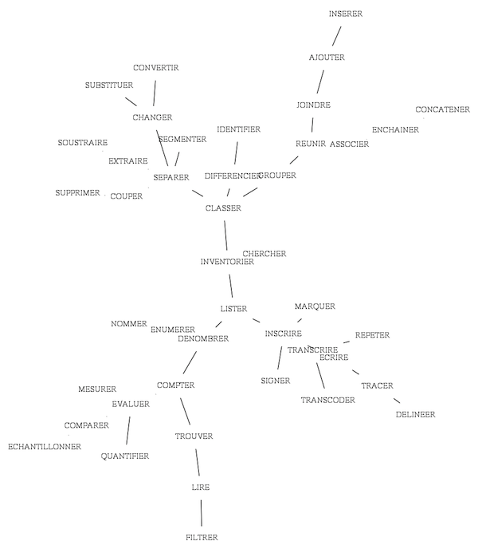

# fv-morphologie

**Tools for the description and morphological study of musical transcriptions.**
Common Lisp version.

Frédéric Voisin, 1994–2013 (PWGL tutorial version 20131111), Common Lisp
version 2026.

> This document is based on the PWGL tutorial kept in
> [`pwgl-legacy/tutorial/`](../pwgl-legacy/tutorial/) (its presentation, its
> menu and the documentation of each patch), translated from French and
> adapted to Common Lisp. All examples have been run with SBCL. Points still
> to be updated are listed at the end, in
> [Notes for the update](#notes-for-the-update).

## Contents

- [Presentation](#presentation)
- [Installation and loading](#installation-and-loading)
- [Menu](#menu)
- [1. Transcription](#1-transcription)
  - [1.1 Transcode](#11-transcode)
  - [1.2 Filter](#12-filter)
  - [1.3 Delineate: graphs](#13-delineate-graphs)
- [2. Classification](#2-classification)
  - [2.1 Segment](#21-segment)
  - [2.2 Concatenate](#22-concatenate)
  - [2.3 Differentiate](#23-differentiate)
- [3. Evaluation](#3-evaluation)
  - [3.1 Enumerate](#31-enumerate)
  - [3.2 Compare: distances and dissimilarities](#32-compare-distances-and-dissimilarities)
  - [3.3 Quantify: information](#33-quantify-information)
- [4. Reading and writing files](#4-reading-and-writing-files)
- [5. FV-examples](#5-fv-examples)
- [PWGL boxes and Common Lisp functions](#pwgl-boxes-and-common-lisp-functions)
- [Notes for the update](#notes-for-the-update)

## Presentation

fv-morphologie is a collection of tools for analysing musical utterances
represented by sequences of symbols (notations, transcriptions, symbolic or
numerical representations, etc.): segmentation, search for motifs and salient
features, recognition of musical "forms", comparison of structures, automatic
classification…

As in Lisp, an object or a musical sequence is represented or described by
**lists**, structured or not, in a way made explicit by their context. By
convention, a musical sequence or a sequence of symbols is an ordered list
that begins, on the left, with the oldest item. For example, the list
`(60 65 70 72)` can represent, depending on the analysis, the notes C F B♭ C
(MIDI standard), a four-note chord (arbitrarily from low to high), a
variation of intensity, etc.

This version, started in 2007 for teaching computer music (Conservatoire de
Montbéliard, 2007–2012), is a rewrite of *Morphologie* for OpenMusic (Ircam) with
a port to PWGL (Mikael Laurson, Sibelius Academy). It takes up the code devoted to 
the analysis and classification of data (cf.  Baboni-Schilingi & Voisin, 
*Librairie Morphologie pour OpenMusic*, Ircam Forum, 1997), within a theoretical 
framework that we tried to make explicit "pragmatically".

The analysis operations are grouped in three families, which make up the
structure of the menu: **transcription**, **classification**, **evaluation**.
This grouping itself results from an analysis, with fv-morphologie, of the
semantic field covered by these operations (cf.
`pwgl-legacy/tutorial/5. FV-exemples/delineations/`):



*The operations of fv-morphologie: minimum spanning tree of the (French)
verbs naming them, drawn with `graph-span` and `graph>dot`.*

Morphologie was first imagined and developed with Hervé Rivière at
LACITO-CNRS (1992), using Patchwork (Ircam). Thanks to Jacopo
Baboni-Schilingi, Giacomo Platini, Paolo Aralla, Kilian Sprotte, Julien
Vincenot and Carlo Ciceri.

About:

- Legacy PWGL fv-morphologie doc page : <https://www.fredvoisin.com/articles/114-fv-morphologie-documentation.html>
- *Dissemblance et espaces compositionnels* (Frédéric Voisin, JIM 2011):
  <https://www.fredvoisin.com/articles/185-dissemblance-et-espaces-compositionnels.html>
- Original code (~1995) : <https://github.com/openmusic-project/Morphologie>

## Installation and loading

The library is an ASDF system with no dependency outside ASDF/UIOP. Make the
project directory visible to ASDF (for example with a symlink in
`~/quicklisp/local-projects/`), then:

```lisp
(asdf:load-system :fv-morphologie)
(in-package :fv-morphologie)
```

All the examples below are evaluated in the `:fv-morphologie` package.

- `graph>dot` needs [Graphviz](https://graphviz.org/) (`neato`) to produce
  images.
- The tests use [FiveAM](https://github.com/lispci/fiveam), only for testing
  the code: `(asdf:test-system :fv-morphologie)`.

In PWGL and OpenMusic, fv-morphologie required the
[ompw](http://kiliansprotte.de/lisp/#ompw) library (Kilian Sprotte); the
Common Lisp version does not.

## Menu

```
;;; 1. TRANSCRIPTION
;;  1.1 TRANSCODE : convert, encode, trace
       transcode, num>base, num>alpha, alpha>num, list>sym, str->symb, filt-noise
;;  1.2 FILTER
       filt-median, filt-mean, filt-lowpass, filt-local-rep, filt-fct
;;  1.3 DELINEATE : trace graphs
       graph-span, graph-path, graph>dot
;;; 2. CLASSIFICATION
;;  2.1 SEGMENT : cut, split
       int-signature, exsample, split, graph-part
;;  2.2 CONCATENATE : group, assemble
       motif-group, list>sym
;;  2.3 DIFFERENTIATE : classify, identify
       mark-structure, motif-structure, class-num, class-sym
;;; 3. EVALUATION
;;  3.1 ENUMERATE : sample, find, count
       mark-position, mark-list, motif-find, motif-list, graph-nodes, graph-extrem
;;  3.2 COMPARE : distances and dissimilarities
       dist-euclidian, dist-citybloc, dist-hamming, dist-edit,
       dist-multi-edit, dist-structure, dist-graph
;;  3.3 QUANTIFY : self information
       histogram, entropy, elt-info, inner-dynamic, graph-length, graph-degree
;;; 4. READ/WRITE files
       read-text, write-list, display-list
```

In the REPL, `(doc)` lists the documented functions and `(doc 'dist-edit)`
prints the documentation of one of them.

## 1. Transcription

### 1.1 Transcode

Different sorts of transcoding: from symbols to numbers and back, between
number bases, from lists to symbols.

#### `transcode (seq table &optional test)`

Replaces each element of `seq` found in `table`, a list of `(old new)` pairs.
Elements not in the table are kept. The default test is `#'eq`.

```lisp
(transcode '(a b c a) '((a x) (c z)))                  ;=> (X B Z X)
(transcode '(c d e) *very-minimalist-midi-notes* #'string-equal)
;=> (72 62 64)
```

#### `num>base (num base)`

Converts a number, or a list of numbers, into base `base` (0 if the base is
lower than 2). If `base` is `nil`, the numbers are written out in English.
If `base` is a list, gives one result per base.

```lisp
(num>base 10 2)          ;=> 1010
(num>base 255 16)        ;=> FF
(num>base 5 '(2 3))      ;=> (101 12)
(num>base 10 nil)        ;=> TEN
```

#### `num>alpha (num)`

Converts non-negative integers to letters: 0 → A, 1 → B, …, 25 → Z, 26 → AA.

```lisp
(num>alpha '(0 1 27))    ;=> (A B AB)
```

#### `alpha>num (char &optional mode)`

Converts symbols or strings to character codes (ASCII). With mode `:midi`,
converts a note name (A to G) to a MIDI pitch.

```lisp
(alpha>num 'abc)         ;=> (65 66 67)
(alpha>num "abc")        ;=> (97 98 99)
(alpha>num "C" :midi)    ;=> 72
```

#### `list>sym (list)`

Concatenates a flat list into one symbol, number or string, depending on the
type of its elements.

```lisp
(list>sym '(a b c))      ;=> ABC
(list>sym '(1 2 3))      ;=> 123
```

#### `str->symb (strings)`

Reads a string (or a list of strings) as a list (or lists) of symbols.

```lisp
(str->symb "a b c")          ;=> (A B C)
(str->symb '("a b" "c"))     ;=> ((A B) (C))
```

#### `filt-noise (seq &optional mode val)`

*PWGL box: `randomize`.* Jitters a sequence or adds noise to it, according to
`mode`:

- `:nozero` (default): replaces each zero value with a random value;
- `:swap`: substitutes some values with others;
- `:relative`: relative noise of amount `val`.

### 1.2 Filter

#### `filt-median (seq window)`

Sliding median over `window` values: removes isolated peaks.

```lisp
(filt-median '(1 9 1 1 1 9 1) 3)     ;=> (1 1 1 1 1 1 1)
```

#### `filt-mean (seq wind &optional step)`

Sliding mean over `wind` values.

```lisp
(filt-mean '(1 2 3 4 5 6) 2)         ;=> (1.5 2.5 3.5 4.5 5.5 6.0)
```

#### `filt-lowpass (seq alpha &optional gamma)`

*PWGL box: `filt-exponential`.* Exponential smoothing: each value moves by
the fraction `alpha` towards the input. With `gamma`, double exponential
smoothing.

```lisp
(filt-lowpass '(0 10 0 10 0) 0.5)    ;=> (0 5.0 2.5 6.25 3.125)
```

#### `filt-local-rep (seq &optional mode test)`

Removes consecutive identical elements (default behaviour, or mode
`:delete`).

With numerical sequences, mode `:linear` keeps the length of the sequence
and replaces consecutive identical values by a linear interpolation between
the non-identical values around them.

`test` defines the identity of elements (`#'equalp` by default), for example
to treat close values as identical.

```lisp
(filt-local-rep '(a a b b b c a b b a a))      ;=> (A B C A B A)
(filt-local-rep '(0 0 1 2 2 2 3 3 0 0))        ;=> (0 1 2 3 0)
(filt-local-rep '(0 0 1 2 2 2 3 3 0 0) :linear)
;=> (0.0 0.5 1 2.0 2.3333333 2.6666667 3.0 1.5 0.0 0.0)
```

#### `filt-fct (seq func wind &optional step)`

Applies the function `func` to a sliding window of `wind` values, by steps of
`step`. Window and step may be integers (numbers of values) or floats
(fractions of the sequence).

### 1.3 Delineate: graphs

*Delineation: tracings, plans, projections, surveys.*

Graphs are a convenient and powerful way to represent and study large sets of
data, and the relationships and classification of arbitrary objects.

In fv-morphologie, an edge (segment) of a graph is a list made of a node,
another node and the distance between them, e.g. `(A B 1.5)`. A graph is a
list of edges:

```lisp
((A B 1.5) (B C 2.1) (B D 3.2) ...)
```

This is the same shape as the *semi-matrix of distances* returned by the
distance functions (see [3.2](#32-compare-distances-and-dissimilarities)),
`(i j d(i,j))`, so the output of a distance function can be used as a graph.

#### `graph-span (mat-dist &optional verbose)`

Minimum spanning tree of a set of objects, deduced from the semi-matrix of
their distances (Prim's algorithm, after Diday et al., *Éléments d'analyse de
données*, Dunod, 1982). The result is the minimal set of edges
`(obj-A obj-B distance)` needed to draw the tree. The order of the edges may
vary between calls.

```lisp
(graph-span '((0 1 1) (0 2 4) (1 2 2) (2 3 1)))
;=> ((2 3 1) (1 2 2) (0 1 1))     ; edge (0 2 4) is not needed
```

In the PWGL tutorial (`1.3.1_graph-span`), random melodic profiles are
compared with each other by the edit distance of their signatures, and
`graph-span` gives the tree of their resemblances.

#### `graph-path (from to graph)`

The nodes on the path between two nodes of a tree.

```lisp
(graph-path 'a 'c '((a b 1) (b c 2) (b d 1)))   ;=> (A B C)
```

#### `graph>dot (graph out &key dis scale shape legend)`

Draws an undirected graph in the **dot** format.

Drawing large graphs automatically, in a readable and pleasant way, is a
complex problem and still a research subject. The dot language describes
graphs (directed or not) in text files (`.dot`); it is used by several free
programs on all platforms.

`neato` (Stephen C. North, AT&T labs) draws undirected graphs. It is based on
a physical model that iteratively looks for stable or metastable equilibria
between forces attached to the nodes (cf. Kamada & Kawai, *Information
Processing Letters* 31:1, 1989). The computation can be long and, as its
initial state is random, the drawing may differ from one run to the next.
neato can write png, gif or svg files; svg is preferable for large graphs.
neato is part of [Graphviz](https://graphviz.org/)
([neato guide](https://graphviz.org/pdf/neatoguide.pdf)).

Arguments:

- `out`: `t` or `nil` prints the dot text to the listener; a stream writes to
  it; a pathname writes a `.dot` file and, if the type is `png` or `gif`,
  also runs `neato` to make the image.
- `:dis`: how much the drawing may distort the lengths (0.0–1.0).
- `:scale`: scale of the shortest edge.
- `:shape`: node shape (a Graphviz shape name such as `"ellipse"`,
  `"plaintext"`, `"point"`), or a list of two shapes: ordinary nodes, and
  nodes joined by zero-length edges.
- `:legend`: label the edges with their lengths (`t` by default).

Edges of length 0 are drawn in blue.

```lisp
(graph>dot '((a b 1) (a c 2) (b d 0)) "/tmp/graph.png")
;=> "/tmp/graph.png"     ; writes /tmp/graph.dot and /tmp/graph.png
```

The dot file can also be drawn by hand: `neato -Tpng graph.dot -o graph.png`.

## 2. Classification

The functions of this group differentiate the elements or motifs of a
sequence according to various criteria or processes:

- **segmentation**, according to
  - variations of intensity (`int-*`),
  - the repetition of marks (`mark-*`),
  - the repetition of motifs (`motif-*`);
- **classification** of (musical) objects represented in a space of
  arbitrary dimension, normed, Euclidean or symbolic (`class-*`);
- **concatenation** of predefined segments, or of segments obtained by
  segmentation or classification.

### 2.1 Segment

#### `int-signature (seq mode thres &optional option)`

The *signature* of a variation of intensity is the set of its most
characteristic variations — minima, maxima and possibly inflexions — in other
words an anomalous and singular set of salient points, or folds.

Deleuze associates the signature with the *ritournelle* which, "by selecting
components of milieus that it expresses, makes territory, self-posited
intensity, mark, signature" (*Mille plateaux*, p. 390). It can also be seen
as a trace, and so result from processes of erasure (cf. Derrida).

The scientific literature on time series uses the terms "signature" (Hetland),
"landmarks" (Perng, Parker & Leung) or "important extrema" (Fink & Gandhi).
They cover the same meaning but use different methods: one variation of
intensity does not necessarily have a single signature.

In fv-morphologie, each salient point (fold) is a list of:

- its position in the original sequence;
- its type: minimum (`-1`), maximum (`1`) or inflexion (`0`);
- for convenience, the value of the sequence at that position.

`thres` (0.0–1.0) ignores variations smaller than this fraction of the
overall range of the sequence (`nil` or 0: no threshold). Modes:

- `:minflexmax`: minima, maxima and inflexions (`option`: distance threshold,
  in ranks, for detecting inflexions);
- `:minmax`: minima and maxima only;
- `:major-extrema`: Fink & Gandhi method (`option`: distance for comparing
  local extrema);
- `:landmarks`: Perng, Parker & Leung method (`option`: distance threshold,
  in ranks, for detecting a major extremum).

```lisp
(int-signature '(0 2 4 3 1 2 6 5 0) :minmax 0)
;=> ((2 1 4) (4 -1 1) (6 1 6))
```

References (as given in the PWGL tutorial):

- Deleuze, *Mille plateaux*.
- Derrida, *La différance – de la philosophie*, 1972; *L'animal que donc je
  suis*, 2004.
- Fink & Gandhi, "Important extrema in time series", *Conference on Systems,
  Man and Cybernetics*, 2007.
- Hetland, "A survey of recent methods for efficient retrieval of similar
  time sequences", in *Data Mining in Time Series Databases*, Series in
  Machine Perception and Artificial Intelligence, vol. 57, 2004.
- Perng, Parker & Leung, "Representing time series by landmarks",
  *Conference on Information and Knowledge Management*, 1999.

#### `exsample (seq method mode thres &optional option)`

*Exsample*: a variant of the etymological root of "example", French
"échantillonner" and English "sample". It summarizes a variation of intensity
by its most significant values, i.e. the points of its signature (plus the
first and last values). The resulting compression rate cannot be predicted:
it depends both on the overall shape of the variation and on the method used
to extract its signature.

`method` is one of the `int-signature` modes (`nil` means `:minflexmax`).
`mode` is:

- `:values` (default): the values;
- `:positions`: their positions;
- `:all`: `(position value)` pairs;
- `:resampled`: the time proportions between the points are kept, with a
  linear interpolation between them; the result has the same number of values
  as the original sequence.

```lisp
(exsample '(0 2 4 3 1 2 6 5 0) :minmax :values 0)     ;=> (0 4 1 6 0)
(exsample '(0 2 4 3 1 2 6 5 0) :minmax :positions 0)  ;=> (0 2 4 6 8)
(exsample '(0 2 4 3 1 2 6 5 0) :minmax :all 0)
;=> ((0 0) (2 4) (4 1) (6 6) (8 0))
(exsample '(0 2 4 3 1 2 6 5 0) :minmax :resampled 0)
;=> (0 2 4 5/2 1 7/2 6 3 0)
```

#### `split (seq &optional marks)`

*PWGL box: `mark-cut`.* Cuts a string at any of the characters in `marks`
(and at blanks), or a list at any element of the list `marks`. The marks are
not kept.

```lisp
(split "hello big world")            ;=> ("hello" "big" "world")
(split "a,b;c" ",;")                 ;=> ("a" "b" "c")
(split '(a b x c d x e) '(x))        ;=> ((A B) (C D) (E))
```

#### `graph-part (graph &optional mode)`

Partitions a tree by removing its longest edge(s). The only mode is
`:distance`. Experimental.

```lisp
(graph-part '((2 3 0.33333334) (0 2 1.0) (1 4 0.25) (0 4 0.25)))
;=> (((2 3 0.33333334)) ((1 4 0.25) (0 4 0.25)))
```

### 2.2 Concatenate

#### `motif-group (seq test &optional key)`

Groups in one list the consecutive elements or motifs of `seq` for which the
comparison `test` succeeds. `test` takes two arguments, the previous element
and the next one (default: `#'equalp`). The optional `key` is applied to each
element or motif before the comparison.

By default, when the elements are symbols, the criterion is their identity.
When they are lists, the criterion is both the identity and the arrangement
of their elements. Elements left alone are not put in a list.

```lisp
;; identical numbers
(motif-group '(1 1 2 2 2 3) #'=)
;=> ((1 1) (2 2 2) 3)
;; close numbers
(motif-group '(1 2 10 11 12 30) (lambda (a b) (< (abs (- a b)) 3)))
;=> ((1 2) (10 11 12) 30)
```

Other tests from the PWGL tutorial: the next element equals the previous one
+ 1; motifs made of the same symbols whatever their order; motifs with the
same first (or last) element; motifs where the last element of one is the
first of the next.

#### `list>sym (list)`

*PWGL box: `group`.* Concatenates a list into a single symbol, number or
string (see [1.1](#11-transcode)).

### 2.3 Differentiate

#### `mark-structure (seq out &key diss rem-loc-dup test)`

Contrastive analysis of a sequence of arbitrary symbols: each symbol (mark)
starts segments, and the repetitions of these segments give a structure. The
structures are sorted by length. Three presentations of the result (`out`):

- `:struct` (or `nil`): only the structures;
- `:pos`: each structure with the positions of its segments, followed by the
  segments: `(structure (positions segment-i ... segment-n))`;
- `:raw`: each structure with each segment and its position:
  `(structure ((segment-i position-i) ... (segment-n position-n)))`.

Options:

- `:diss`: tolerance for dissimilarity between segments, as a normalized edit
  distance. Two segments with different initial marks can then be considered
  similar.
- `:test`: identity of the initial marks. Its choice defines the
  *contrastive* criterion of segmentation (default: `#'equalp`). For example,
  `(lambda (x y) (< (- y x) 2))` segments only where the marks make a small
  ascending movement.
- `:rem-loc-dup`: if true (default), consecutive identical elements are
  removed from the sequence first.

```lisp
(mark-structure '(a b c a b d a b) nil)
;=> ((0 1 2) (0 1 2))
(mark-structure '(a b c a b d a b) :pos)
;=> (((0 1 2) ((1 4 7) (B C A) (B D A) (B)))
;    ((0 1 2) ((0 3 6) (A B C) (A B D) (A B))))
```

#### `motif-structure (seq)`

The structure of `seq` in terms of its repeated motifs: the positions of the
motifs, then the motifs.

```lisp
(motif-structure '(a b c a b c d))
;=> (((0 0) (3 0)) ((A B C)))
```

#### `class-num (data classes mode &key iter dist)`

Classification of numerical data, i.e. data represented in a space where each
dimension is numerically ordered, such as a Euclidean space. In one
dimension, each datum is a number; in N dimensions, each datum is a list of
its coordinates.

The number of classes and the algorithm must be given. Modes:

- `:centroids` (or `nil`): centroid method (*nuées dynamiques*, k-means).
  With `:iter nil` (default), the result is a list of: the class of each
  point of `data`, the centre of gravity of each class, and the number of
  iterations needed for the algorithm to converge. As the centroids start at
  random, results can vary: with an integer `:iter` *k*, the algorithm runs
  *k* times and returns two values, the most frequent partition and its
  frequency; with `:iter t`, it runs classes² times and returns the most
  frequent partition. `:dist` sets the distance (Euclidean by default).
- `:1d-centroids`: classification of a list of numbers in one dimension
  (e.g. a variation of intensity). An automatic partition of the successive
  differences (N+1 − N) gives plausible classes for the centroid algorithm
  (an original, empirical method, Fred Voisin 2010). `:dist` is then a
  function applied to the successive differences, which changes the metric of
  the differentiation: for pitches, whose differentiation decreases roughly
  logarithmically as they rise, a function such as
  `(lambda (x) (expt x 0.5))` compensates the scale.

Classification can also be diverted to *quantize* a continuous flow: the
flow is then quantized not on values fixed a priori but on centres of
attraction or zones of stability inherent to the flow, which are not
necessarily equidistant. Computation time grows with the length of the flow
and with the number of classes.

```lisp
(class-num '((0 0) (0 1) (10 10) (10 11)) 2 :centroids)
;=> ((0 0 1 1) ((0.0 0.5) (10.0 10.5)) 3)
(class-num '((0 0) (0 1) (5 5) (5 6) (10 10) (10 11)) 3 :centroids :iter 20)
;=> (0 0 1 1 2 2)
```

#### `class-sym (data classes mode &key uncom ins del change excluded mst)`

Classification of symbolic forms made of arbitrary symbols. It partitions the
minimum spanning tree built on the dissimilarities between the forms, by
default their edit distances. Returns the class number of each form, from 0.

- `mode`: `:edit-nn` (or `nil`), absolute edit distance; `:edit-norm`,
  relative edit distance.
- `:change`, `:ins`, `:del`, `:uncom`: costs of the edit distance (see
  `dist-edit`).
- `:excluded`: forms excluded from the classification. Each excluded form is
  numbered first, from 0, and the classes found follow. Useful for example to
  exclude silences from the classification but keep them in the
  transcription.
- `:mst`: a minimum spanning tree already computed, which saves its
  computation.

```lisp
(class-sym '((a b c) (a b d) (x y z) (x y w) (a b c d)
             (k l m n o p) (k l m n o q))
           3 :edit-norm)
;=> (0 0 2 2 0 1 1)
```

## 3. Evaluation

Measures of distance and resemblance, and measures of inherent information
coming from information theory and graph theory.

### 3.1 Enumerate

#### `mark-position (seq mark &optional test cons)`

Positions of `mark` in `seq`.

```lisp
(mark-position '(a b c a b) 'a)   ;=> (0 3)
```

#### `mark-list (seq mark &key mark-t seg-t)`

The segments starting with each mark, with their positions:
`((segment positions) ...)`. If `mark` is `nil`, each distinct symbol of
`seq` is a mark. With local repetitions, the first occurrence of the symbol
is used.

The segments depend on equivalence classes that can be defined freely:

- `:mark-t`: identity of the marks, a binary predicate (default `#'equalp`).
  For example, a mark can be defined as an ascending movement.
- `:seg-t`: identity of the segments, a binary predicate (default
  `#'equalp`). Segments that are not identical but close can then be grouped
  as one.

```lisp
(mark-list '(a b c a b d) 'a)
;=> (((A B C) (0)) ((A B D) (3)))

;; segments closer than 2 in edit distance count as the same
(mark-list '(a b c d a x y a b e d a w z) 'a
           :seg-t (lambda (a b) (< (dist-edit a b) 2)))
;=> (((A B C D) (0 7)) ((A X Y) (4)) ((A W Z) (11)))
```

#### `motif-find (motif seq &key diss l-var change ins del uncom test)`

*PWGL box: `motif-position`.* All positions of a motif in a sequence of
symbols, as `(start end)` pairs.

- `:diss`: maximum dissimilarity accepted, as a fraction of the length of the
  motif, measured with the edit distance. 0: only identical motifs; 0.5:
  motifs differing by at most half of their elements.
- `:l-var`: maximum variation of the length of the motifs found, as a
  fraction of the length of the motif (0, the default: same length only).
- `:test`: identity of the elements (default `#'equalp`). For example, with
  motifs made of pairs, a test on the first element of each pair.
- `:change`, `:ins`, `:del`, `:uncom`: costs of the edit distance (see
  `dist-edit`).

Numbers are treated as arbitrary symbols: the distance between `(0 2 1 1)`
and `(0 1 1 1)` is the same as between `(0 2 1 1)` and `(0 0 1 1)`, since
only one symbol changes. Motifs can be made of elements that are themselves
lists, e.g. `((a 1) (b 1) (c 1))`.

```lisp
(motif-find '(a b) '(a b c a b d a b))
;=> ((0 1) (3 4) (6 7))
(motif-find '(a b) '(a b c a c d a b))
;=> ((0 1) (6 7))
(motif-find '(a b) '(a b c a c d a b) :diss 0.5)
;=> ((0 1) (3 4) (6 7))
```

#### `motif-list (seq out &key diss l-var n change insert delete uncom test)`

The list of the motifs repeated in `seq`, with their positions:
`((motif (start end) ...) ...)`.

- `out`: `:length` (or `nil`) sorts by decreasing length of the motifs,
  `:freq` by decreasing frequency.
- When a motif is an exact sub-sequence of a longer motif and always occurs
  inside it, only the positions of the longer motif are given.
- `:diss`: maximum dissimilarity (0–1, relative edit distance). Only the
  first occurrence of each motif is given, followed by the positions of its
  more or less different repetitions.
- `:l-var`: tolerance on the variation of length of similar motifs, as a
  fraction of their length. It is implicitly linked to `:diss`: allowing a
  variation of length makes little sense if the dissimilarity threshold is 0.
- `:n`: maximum length of the motifs.

The search is exhaustive: time and memory grow exponentially with the length
of the sequence.

```lisp
(motif-list '(a b c a b c d a b c) nil)
;=> (((A B C) (0 2) (3 5) (7 9)))
```

#### `graph-nodes (graph)`, `graph-extrem (graph)`

All the nodes of a graph (each once, sorted: numbers first, then by name),
and its extremities (leaves).

```lisp
(graph-nodes '((a b 1) (b c 2) (b d 1)))    ;=> (A B C D)
(graph-extrem '((a b 1) (b c 2) (b d 1)))   ;=> (D C A)
```

### 3.2 Compare: distances and dissimilarities

For all the distance functions, when the first argument is a list of items
(points or sequences) and the second is `nil`, the result is the
**semi-matrix of distances** between all items, as a list of `(i j d(i,j))`:

```lisp
(dist-euclidian '((0 0) (3 4) (6 8)) nil)
;=> ((0 1 5.0) (0 2 10.0) (1 2 5.0))
```

#### `dist-euclidian (a b)`

Euclidean distance. All points must have the same dimensionality, which is
the length of the list of their coordinates: each rank of the list is the
coordinate of the point on the corresponding dimension.

```lisp
(dist-euclidian '(0 0) '(3 4))   ;=> 5.0
```

#### `dist-citybloc (a b)`

City-block distance: the sum of the absolute differences on each dimension.
As for the Euclidean distance, all points must have the same dimensionality.

```lisp
(dist-citybloc '(0 0) '(3 4))    ;=> 7
```

#### `dist-hamming (a b &optional norm test)`

Hamming distance, used in information theory, between sequences of the same
length: the number of positions where they differ, divided by the length of
the sequences. It is 0 for identical sequences and 1 for completely different
ones.

- `norm`: normalized distance (`t`, default) or raw count (`nil`);
- `test`: identity of the elements (`#'eq` by default). For example, a test
  that considers two letters identical when their ASCII codes differ by at
  most 1.

```lisp
(dist-hamming '(a b c d) '(a x c y))       ;=> 0.5
(dist-hamming '(a b c d) '(a x c y) nil)   ;=> 2
```

#### `dist-edit (seq1 seq2 &key sub ins del uncom norm test)`

Edit distance (Levenshtein distance) between two sequences of symbols: a
measure of dissimilarity equal to the minimal cost of the insertions,
deletions and substitutions that turn one sequence into the other.

- `:sub`, `:ins`, `:del`: cost of substituting, inserting and deleting a
  symbol (1 by default);
- `:uncom`: cost of substituting a symbol that is not common to both
  sequences (0 by default);
- `:norm`: absolute distance (`nil`, default) or relative to the length of
  the longest sequence (`t`);
- `:test`: identity of the elements (`#'equalp`).

The longest sequence's length minus the edit distance gives the length of the
longest common sub-sequence. Works on lists, strings and symbols.

```lisp
(dist-edit '(a b c) '(a b c))            ;=> 0
(dist-edit "kitten" "sitting")           ;=> 3
(dist-edit '(a b c) '(a c))              ;=> 1
(dist-edit '(a b c) '(a c) :sub 0)       ;=> 1   ; a deletion is still needed
(dist-edit '(a b c) '(a c) :del 0)       ;=> 0   ; deleting b is free
(dist-edit '(a b c) '(a c) :del 5)       ;=> 5   ; one deletion is unavoidable
(dist-edit '(a b c) '(a c) :uncom 1)     ;=> 2   ; b is not in (a c)
(dist-edit '(a b c d) '(a b) :norm t)    ;=> 0.5
```

#### `dist-multi-edit (seq1 seq2 wgth &key sub ins del uncom test)`

Multidimensional edit distance. Each element of a sequence is described by
several qualitative descriptors (arbitrary symbols), one per rank of a list,
e.g. `(pitch duration)`. The edit distance is applied to each descriptive
dimension and weighted. All elements must have the same number of
descriptors.

`wgth` gives the weight of each dimension (a number gives the same weight to
all); a weight of 0 ignores a dimension. Other options are as for
`dist-edit`.

```lisp
(dist-multi-edit '((a 1) (b 2)) '((a 1) (c 2)) 1)   ;=> 0.25
```

#### `dist-structure (a b &key w-occ w-rep test)`

Distance (dissimilarity) between sequences from the point of view of their
**structure**. The computation — original, empirical and experimental —
compares the occurrences and repetitions in each sequence, using the edit
distance. It is normalized from 0 (complete resemblance) to 1 (complete
dissimilarity).

- `:w-occ`: weight given to the occurrences of the elements;
- `:w-rep`: weight given to the repetitions.

```lisp
;; same structure: distance 0
(dist-structure '(a b a c a d a e a f g h) '(1 2 1 3 1 4 1 5 1 6 7 8))   ;=> 0.0
;; same elements and frequencies, different arrangement
(dist-structure '(a b a c a d a e a f g h) '(a a a a a b c d e f g h))   ;=> 0.33333334
;; contiguous repetitions: very different
(dist-structure '(a b a c a d a e a f g h) '(x x x x y y y x x y y y))   ;=> 0.875
```

#### `dist-graph (v1 v2 graph)`

Distance between two nodes of a graph: the length of the shortest path
between them. Tested only on minimum spanning trees, for which it was
written.

```lisp
(dist-graph 'a 'c '((a b 1) (b c 2) (b d 1)))   ;=> 3
```

### 3.3 Quantify: information

#### `histogram (data &key test thes)`

Histogram of data, as `(element count)`. With numerical data, the result is
sorted by increasing value; with arbitrary symbols, by decreasing frequency.

- `:test`: identity of the elements;
- `:thes`: the elements to count, to the exclusion of the others.

```lisp
(histogram '(a b a c a b))           ;=> ((A 3) (B 2) (C 1))
(histogram '(3 1 2 1 3 3))           ;=> ((1 2) (2 1) (3 3))
(histogram '(a b a) :thes '(a b c))  ;=> ((A 2) (B 1) (C 0))
```

#### `entropy (data &optional mode samples test)`

Estimation of the entropy of a set of data or of a sequence.

`mode`:

- `nil` or `'shannon-2` (default): Shannon entropy in base 2;
- `'shannon-n`: Shannon entropy in base n, for n distinct symbols;
- `'shannon-e`: natural logarithm;
- `'cond-sh`: conditional entropy (experimental).

The Shannon entropy of a random sequence of two symbols tends to 1.0. It is 1
when the symbols are exactly — and globally — equiprobable, and 0 when a
single symbol is repeated, no information being present. With binary
encoding, it is expressed in information per bit. With more than two distinct
symbols, the information can be expressed per bit (`'shannon-2`, maximum
log₂ N) or normalized in base N, the number of distinct symbols
(`'shannon-n`, maximum 1). Any set or sequence of symbols can be measured,
including lists of symbols.

Shannon entropy is based on the global probability of each symbol and does
not consider their arrangement. **Conditional entropy** (`'cond-sh`)
considers the probabilities of the successions of symbols, applying the
principle of Shannon entropy to them. For short random sequences, it is
necessarily lower than the global entropy; the gap narrows as the sequences
grow longer. For sequences made of repetitions, the gap widens.

`samples` follows the evolution of the entropy along the sequence: the
sequence is cut into `samples` windows, and the entropy of each is returned.

```lisp
(entropy '(a a a a) 'shannon-2)              ;=> 0.0
(entropy '(a b a b) 'shannon-2)              ;=> 1.0
(entropy '(a b c d) 'shannon-2)              ;=> 2.0
(entropy '(a b a c) 'shannon-n)              ;=> 0.9463947
(entropy '(a b a b a a a a) 'shannon-2 4)    ;=> (1.0 1.0 0.0 0.0)
```

#### `elt-info (data elt &optional test)`

Self-information of an element: −log₂ of its frequency in `data`. With `elt`
= `nil`, gives every element, from the most to the least informative.

```lisp
(elt-info '(a b a c) 'a)    ;=> 1.0
(elt-info '(a b a c) nil)   ;=> ((B 2.0) (C 2.0) (A 1.0))
```

#### `inner-dynamic (seq &optional test)`

A kind of inner dynamic of the distribution of the symbols (marks) in a
sequence, computed by integrating the contrast/mark analysis: novelty of the
marks and their echoes in the sequence. Rewritten from Paolo Aralla's
"energy profile" (cf. also Baboni-Schilingi, Giacomo Platini). Experimental.

```lisp
(inner-dynamic '(a b a c a d a e))   ;=> (34 24 25 125 17 145 10 154)
```

#### `graph-length (graph)`, `graph-degree (node graph)`

The total length of a tree, and the degree of a node (number of edges at
that node; all nodes if `node` is `nil`).

```lisp
(graph-length '((a b 1) (b c 2) (b d 1)))       ;=> 4
(graph-degree 'b '((a b 1) (b c 2) (b d 1)))    ;=> 3
(graph-degree nil '((a b 1) (b c 2) (b d 1)))   ;=> (1 3 1 1)
```

## 4. Reading and writing files

#### `read-text (file &key mode sep rem-test)`

Imports data from a text file into a list. Modes:

- `t` (*lines*, default): each line becomes a list of symbols or numbers;
- `nil` (*flat*): one flat list of strings;
- `:ascii-7b`, `:ascii-8b`: reads the characters as 7-bit or 8-bit ASCII
  codes, useful when some characters cannot be read by Lisp.

`:sep` is a string of separator characters, besides blanks (e.g. all
punctuation). `:rem-test` is a predicate for words to remove (e.g. words of
less than four letters).

Some special signs, such as punctuation or parentheses (Lisp
S-expressions), may cause errors when reading a file.

```lisp
;; alist.txt contains lines such as "0, 1 2;"
(read-text "alist.txt" :sep ",;")   ;=> ((0 1 2) (1 3 4) (2 5 6))
```

#### `write-list (list file &optional mode)`

Writes a list to a file, one element per line. Sub-lists are written without
parentheses, so `read-text` reads them back. Modes: `:lisp` writes the whole
list inside parentheses; `:coll` writes a Max `coll` file.

```lisp
(write-list '((a b c) (1 2 3)) "out.txt")   ; out.txt: "A B C" / "1 2 3"
(read-text "out.txt")                       ;=> ((A B C) (1 2 3))
```

#### `display-list (list &optional recursive)`

Prints each element of a list on its own line, indented by depth.

## 5. FV-examples

The PWGL tutorial ends with analyses by Frédéric Voisin, in
`pwgl-legacy/tutorial/5. FV-exemples/`, with their data in `data/`. They are
PWGL patches; their principles are summarized here, to be rewritten as
Common Lisp examples.

### Contrastive analysis: marks and resemblance

`mark-list` can treat segments that are not strictly identical but close in
edit distance as one motif, with `:seg-t` (see [3.1](#31-enumerate)).

### Classification, quantization and entropy: *Zoboko*

Automatic transcription of a passage from the rhythmic part of *Zoboko*, a
polyrhythmic instrumental piece from the repertoire of the Aka of Central
Africa. This part, called *diketo*, is played by two machetes struck
together. The intensities of the recording (dB) were measured with
[Praat](https://www.praat.org) into a two-column text file (time,
amplitude): `data/diketo-db.txt`.

For each intensity threshold, from the minimum (18 dB) to the maximum
(46 dB) by steps of 1 dB:

1. keep the amplitudes above the threshold, with their dates;
2. compute the time between successive peaks;
3. classify these time intervals into three classes (`class-num`);
4. compute the entropy of the classification (`entropy`).

The most coherent structure is assumed to be found where the entropy is
lowest (negentropy): at 39 dB (entropy 0.8), the null values corresponding to
empty results being discarded.

### Quantization

Using `class-num` to quantize a flow on its own centres of attraction (see
[2.3](#23-differentiate)).

### Delineations: rhizomatic representation of a text

1. A text (7-bit ASCII) is read into a list of words with `read-text`, all
   punctuation being separators (`:sep`) and words of less than four letters
   being removed (`:rem-test`).
2. Repeated words are removed; words differing by at most one character are
   considered identical, using the edit distance as test of
   `remove-duplicates`.
3. The semi-matrix of the edit distances between the words gives the minimum
   spanning tree (`graph-span`). `:uncom` maximizes the distance between
   words with uncommon characters, hoping to bring words with the same root
   closer.
4. `graph>dot` draws the tree with neato.

Variants: normalized edit distances with a logarithmic scaling of the
distances; the sum of the edit distance and of the distance between the
word frequencies ("the sum of two distances is a distance — is the product of
two distances a distance?"). For large graphs, prefer the svg format.
Computing the spanning tree can take from seconds to hours depending on the
number of elements. Data: `Difference&Repetition-*.txt`, `Alice.txt`,
`Stalker.txt`.

### Segmentation of a fundamental frequency (F0)

Automatic segmentation of an F0 analysis made with Praat, by a minimal time
gap between segments. Only the read and write functions of fv-morphologie
are needed; the segments can be exported, for example as Max `coll` files
(`data/babil-chant-3-*.coll`).

### Automatic transcription of a sonogram: the black redstart

An original method by Frédéric Voisin: a sonogram is considered only as an
image (`data/rougequeue_noir.jpg`), in which motifs are looked for. A
sonogram represents the evolution of sound in time: a succession of instants
described by their spectrum, each region darkened according to its
intensity.

1. The image is converted into text with
   [jp2a](http://jp2a.sourceforge.net/) (`data/rougequeue_noir.txt`): `x`
   for white, `.` for black; 45 lines of 300 characters for 5 seconds, i.e.
   490 Hz and 17 ms per character.
2. Each line is split into its symbols (`alpha>num`), and the list of lists
   is rotated, so that each column — the instantaneous spectrum — becomes a
   "word".
3. The symbols are transcoded to `0` and `1` for readability (`transcode`).
4. The words are classified with `class-sym`, the silent words being
   excluded (`:excluded`), so that silences count in the transcription but
   not in the classification. The result is a sequence of 12 classes of
   instantaneous spectra, plus silence.

A second patch decomposes the process: edit distances between the spectral
words (insertion and deletion cost 1.5, to increase the distances due to
transpositions), minimum spanning tree (`graph-span`), drawing (`graph>dot`),
and classification from that tree (`class-sym` with `:mst`).

## PWGL boxes and Common Lisp functions

| PWGL box | Common Lisp function |
|---|---|
| `randomize` | `filt-noise` |
| `filt-exponential` | `filt-lowpass` |
| `signature` | `int-signature` |
| `mark-cut` | `split` |
| `group` | `list>sym` / `concaten` |
| `motif-position` | `motif-find` |
| `graph-nodes` (with minimum degree) | `graph-nodes` returns all nodes |
| `filt-local-rep` mode `:interp` | `filt-local-rep` mode `:linear` |
| `exsample` mode `:timed` | `exsample` mode `:resampled` |
| `filt-extrema`, `morph-lists`, `graph-hierarc` | not available yet |

## Notes for the update

- **Language**: the legacy text was translated from French; to be reviewed
  by the author.
- **Not yet in the Common Lisp version**: `filt-extrema`, `morph-lists`
  (interpolation, legacy menu 1.4), `graph-hierarc`; and `group` with
  intersection of adjacent lists.
- **Entropy windows**: the legacy doc describes sliding windows with 50 %
  overlap (size 2L/n); the current code uses `samples` consecutive windows of
  size L/n without overlap.
- **`dist-edit` docstring**: says `:norm` divides by the shortest sequence;
  the code (and the legacy doc) use the longest.
- **`class-sym`** does not always return the requested number of classes,
  and `class-num` in `:1d-centroids` mode returns 2 classes only (see the
  TODO in the README).
- **`(help 'keyword)`** is not usable yet; use `doc`.
- **`graph-path`** accepts single nodes only, not lists of nodes.
- **FV-examples** are still to be converted into Common Lisp examples.
- **Figures**: `pictures/menu-*.png` (PWGL menus) and
  `1-Transcription/span-tree.bmp` (a spanning tree drawn with neato) are not
  used yet.
